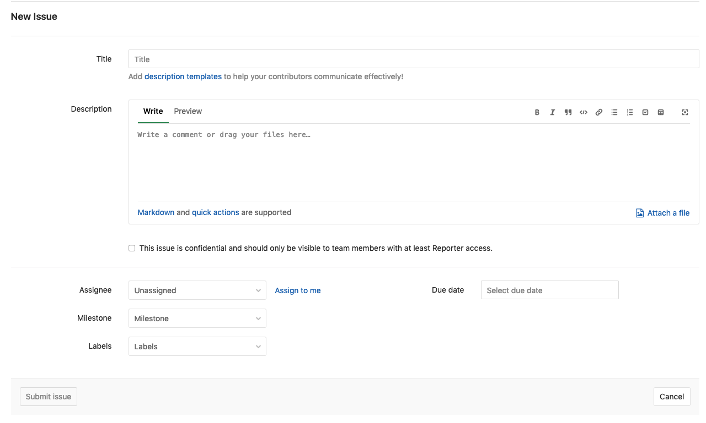
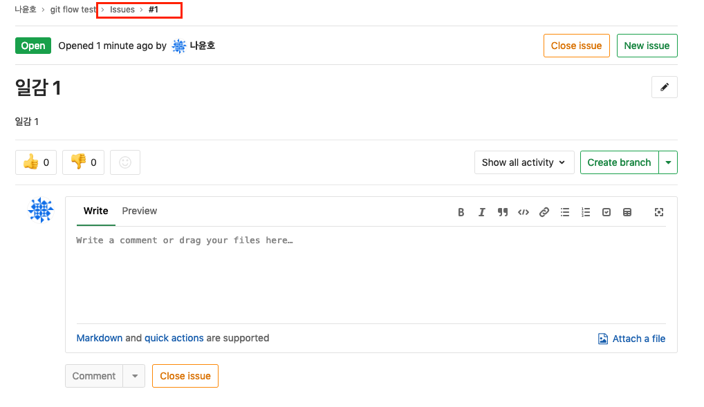
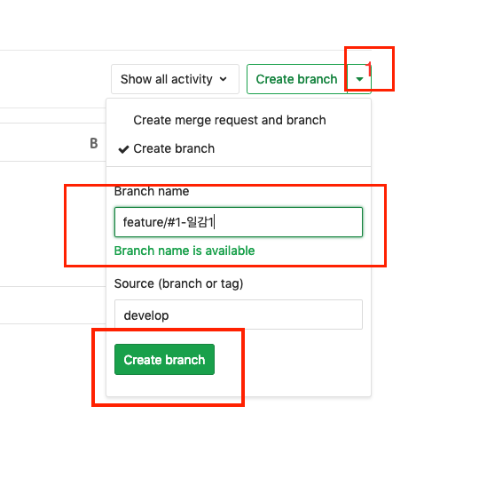
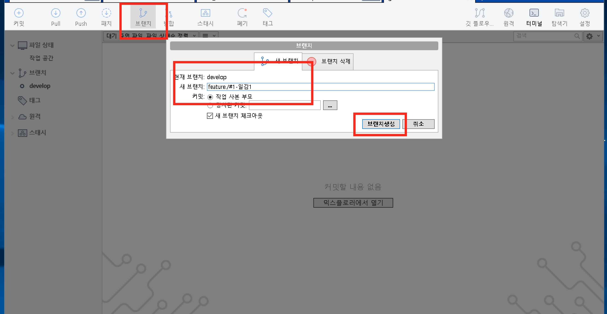
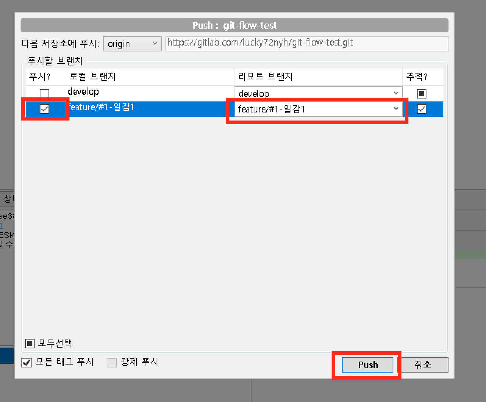
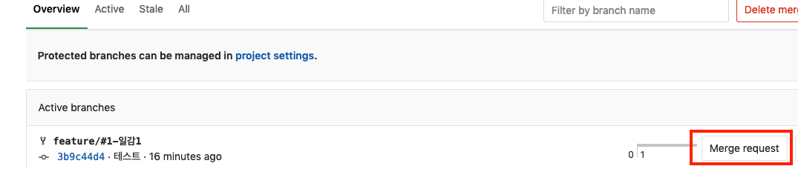
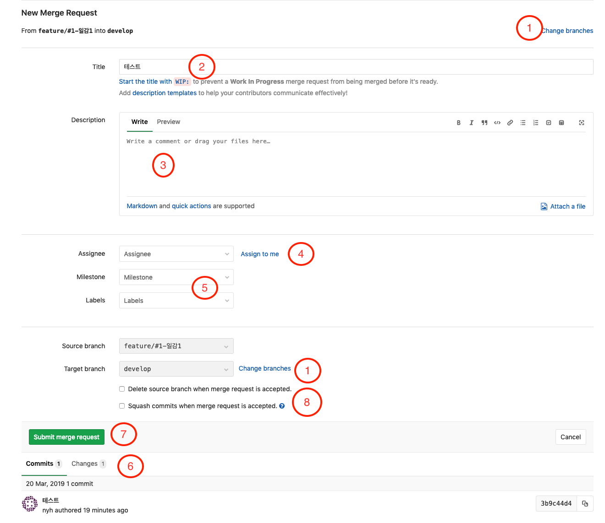
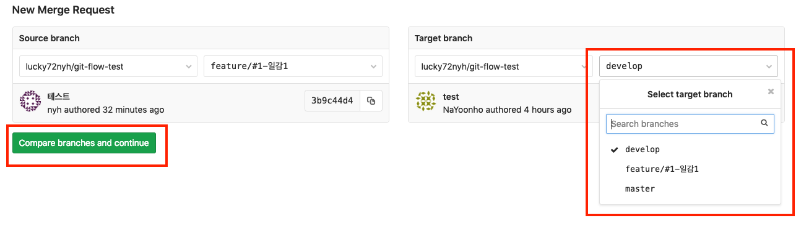

# Gitflow with Gitlab
기능 개발 -> QA(출시 준비) -> 출시 순서대로 작업이 진행되는 최적화된 git 브랜치 전략

## 기본적인 git-flow

> [nvie - Vincent Driessen post 참고](https://nvie.com/posts/a-successful-git-branching-model/)
### 메인 브랜치
- master: 출시 된 버전의 소스가 관리되는 메인 브랜치
- develop: 기능 개발 메인 브랜치
### 서포트 브랜치
- feature: 기능별 분기되는 브랜치
- hotfixes: 출시 후 긴급 수정이 일어나는 브랜치
- relese: 출시 전 QA 진행동안 유지되는 브랜치

## 순서대로 살펴보기
### master, develop

> 참고 [Bitbucket - Gitflow Workflow](https://www.atlassian.com/git/tutorials/comparing-workflows/gitflow-workflow)

메인 브랜치로 처음에 master 브랜치에서 develop 브랜치로 분기한다.
### feature

> 참고 [Bitbucket - Gitflow Workflow](https://www.atlassian.com/git/tutorials/comparing-workflows/gitflow-workflow)
- develop에서 분기되어 완료 후 develop으로 merge 후 삭제된다.
- 기능개발을 위해 분기되며 환경에 따라 이슈 트래커의 이슈명 혹은 이슈번호로 명명(ex: feature/#100-description)
- feature 브랜치간 상호작용해서는 안되며 필요시 `develop` 브랜치를 통해 공유되어야 함
### release

> 참고 [Bitbucket - Gitflow Workflow](https://www.atlassian.com/git/tutorials/comparing-workflows/gitflow-workflow)
- 기능 개발 완료 후 QA 등 출시 준비 시 사용되는 브랜치
- 준비 과정 중 버그 픽스등의 작업이 이루어지는 브랜치
- 명명은 버전으로 한다.(ex: release/0.1.0)
- 출시 준비 완료 후 master 브랜치와 develop 브랜치로 merge된다.
- master 브랜치 merge 후 버전을 tag한다.

### hotfix(bugfix)

> 참고 [Bitbucket - Gitflow Workflow](https://www.atlassian.com/git/tutorials/comparing-workflows/gitflow-workflow)

> 참고 [Azure devops git branching gudeline](https://docs.microsoft.com/en-us/azure/devops/repos/git/git-branching-guidance?view=azure-devops#use-release-branches)
- 출시 후 버그를 고칠 때 mater에서 분기하여 사용하는 브랜치
- 버그 수정 후 master, develop 브랜치로 merge
- Azure devop 가이드라인에서는 release 단계에서도 bugfix, hotfix 브랜치를 운영하라고 가이드하고있다.

## flow 순서
1. mster와 develop 분기
2. `develop -> feature/#100-일감내용`: 기능 개발 진행 시 이슈트래커 일감 생성 후 develop 브랜치에서 feature 브랜치 분기
3. `feature/#100-일감 -> develop`: 기능 개발 완료 후 feature 브랜치 develop 브랜치로 merge
4. `develop -> release/v0.0.1`: 출시 준비 시 develop 브랜치에서 release 브랜치 분기
5. `release/v0.0.1 -> bugfix/#101-버그내용`: 출시 준비 중 이슈 트래커에 등록된 이슈의 번호와 내용으로 release 브랜치에서 bugfix 브랜치 생성
6. `bugfix/#101-버그내용 -> release/v0.0.1`: 버그 수정 후 release 브랜치로 merge
7. `release/v0.0.1 -> master`: 출시 준비 완료 후 버전 태그하여 master merge
8. `release/v0.0.1 -> develop`: 출시 준비 완료 후 develop merge
9. `master -> bugfix/#102-버그내용(hotfix/#102)`: 서비스 운영 중 이슈 트래커에 등록된 이슈를 master 브랜치에서 bugfix 브랜치 생성하여 진행
10. `bugfix/#102-버그내용(hotfix/#102) -> master`, `bugfix/#102-버그내용(hotfix/#102) -> develop`: 이슈 수정 후 master, develop 브랜치로 merge

## Gitlab git-flow 적용해보기
- develop 브랜치 생성 가정
1. issue 생성 - 생성된 이슈 번호를 확인

2. 해당 이슈 번호로 feature 브랜치 생성 및 작업 후 push
   - Gitlab에서 온라인으로 브랜치 생성(생성 후 로컬 작업환경에서 pull 작업 후 push)
        
   - SourceTree(clone 과정 생략)
       
       
3. MergeRequest(서브 브랜치에서 작업 후 메인 브랜치로 merge 시 사용, 코드리뷰시 사용)
   - 브랜치 - MergeRequest 클릭
     
   - Merge Request 신청
     
      1. Target 브랜치를 확인하여 필요시 클릭하여 변경
         
      2. Merge Request 제목
      3. 필요시 내용 입력
      4. 머지 담당자를 지정
      5. 해당 이슈의 마일스톤과 라벨지정
      6. 변경된 사항 내역
      7. Merge Request 신청
      8. Merge 옵션
         - Delete source branch when merge request is accepted: Merge 후 Source 브랜치 제거
         - Squash commits when merge request is accepted: Merge 시 Source 브랜치의 커밋사항 단일 커븟으로 병합

## 참고 글
- [nvie - Vincent Driessen post(git-flow에 대해 처음 게시)](https://nvie.com/posts/a-successful-git-branching-model/)
- [우아한 형제들 기술 블로그 - 우린 Git-flow를 사용하고 있어요](http://woowabros.github.io/experience/2017/10/30/baemin-mobile-git-branch-strategy.html)
- [Bitbucket - Gitflow Workflow](https://www.atlassian.com/git/tutorials/comparing-workflows/gitflow-workflow)
- [Azure devops git branching gudeline](https://docs.microsoft.com/en-us/azure/devops/repos/git/git-branching-guidance?view=azure-devops#use-release-branches)
