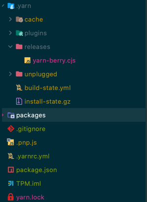

# yarn2

학습 중이지만 lerna 등 다른 monorepo 관리 프로그램이 필요하지 않을 것 같다는
느낌이 든다.


## yarn2 설치

1. yarn 설치  
   `npm install -g yarn`

2. yarn2 설치  
   `yarn set version berry`


- 자동 생성
  - .yarn
  - .pnp.js
  - .yarnrc.yml

## [Workspaces](https://yarnpkg.com/features/workspaces)

mono repo 구성을 위한 yarn

### package.json 설정
    ```json
    "workspaces": [
        "packages/*"
      ],
    ```

### 명령어

- [yarn workspaces foreach]()
  - 현재, 하위 workspace에서 script 실행
  - 실행하기 위해선 `yarn plugin import workspace-tools` 설치 필요
  - ex) `yarn workspaces foreach -A run test`
    - 현재, 하위 workspace의 test script 실행
  - [옵션](https://yarnpkg.com/cli/workspaces/foreach#options)
    - -A: 모든 workspace
    - -p: parallel 실행
    - -no-private: private workspace 실행하지 않음
    - 추가 링크 참조

