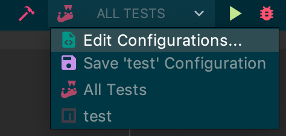
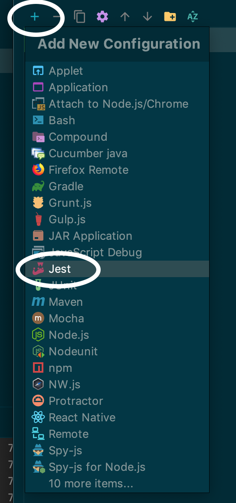
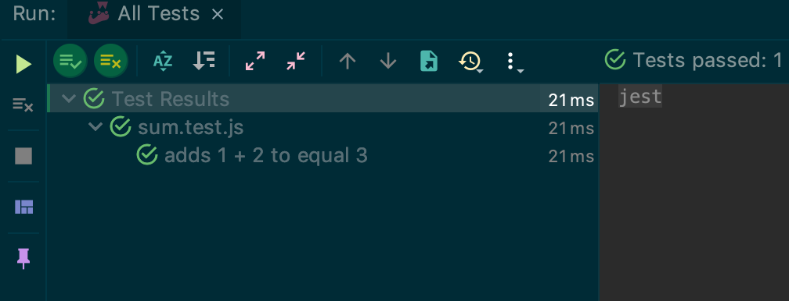

# TodoMVC 만들면서 TestCode 짜보기
- TodoMVC의 구현은 [TodoMVC 사이트](http://todomvc.com/)를 참고 함.
- 테스트 프레임워크는 [Jest](https://jestjs.io/)를 사용.
- IDE [WebStorm](https://www.jetbrains.com/webstorm/)을 개발도구로 사용하는 것을 전제로 작성.

## Jest
> Jest is a delightful JavaScript Testing Framework with a focus on simplicity.
- [https://jestjs.io](https://jestjs.io/)
- Javascript 유닛 테스트 툴
- 오픈소스이며 facebook 그룹 하위에 있다. [https://github.com/facebook/jest](https://github.com/facebook/jest)

## Jest 살펴보기
- [sum function 테스트 코드 따라해보기](https://jestjs.io/docs/en/getting-started.html)
    1. `npm init` or `yarn` 
    2. `npm install --save-dev jest`
    3. sum.js
    4. sum.test.js
    5. package.json -> scripts { test: 'jest' }
    6. npm run test
    7. WebStorm(Intellij IDEA)에서 실행
        
        
        
        
        

## 테스트 코드
- 피드백
  - 작성하는 기능과 이전에 개발한 기능이 아무 문제 없는지 테스트가 알려주므로 새로 추가하는 기능에만 집중
- 명세로서의 테스트 코드
  - TDD 방벙론으로 테스트 코드를 작성하다 보면 소프트웨어 기능 위주의 테스트 코드가 작성이 되고 자연스레 명세 위주의 테스트 코드가 작성
  - 그렇게 점진적으로 작성된 테스트 코드는 side effect가 생기지 않는지 회귀 테스트를 하게된다.
- 테스트 주도 개발:TDD(Test Driven Development)
  - 테스트 코드 작성 -> 테스트 코드 실패 -> 코드 수정 -> 테스트 코드 성공 -> 리팩토링 -> 테스트 코드 실패
  - > 엄청난 흥미를 가지고 새 프로젝트를 시작해서는 시간이 지남에 따라 서서히 코드가 썩어가는 걸 보게 된다. ... 코드를 던져버리고 다음 프로젝트가 시작되기만을 기다리는 것이다. TDD는 시간이 지남에 따라 코드에 대한 자신감을 점점 더 쌓아갈 수 있게 해준다. 테스트가 쌓여감에 따라(그리고 여러분의 테스팅 기술이 늘어감에 따라)... 점점 더 많은 설계 변경이 가능해진다. - TDD p320
- 테스트 작성의 목표
  - 품질 향상에 도움
    - 명세
    - 버그 퇴치
    - 결함 국소화
      - 단위 테스트는 왜 잘 돌아가지 않는지를 알려주어야 한다.
  - 테스트 대상 시스템(SUT)을 이해하는데 도움
  - 위험을 줄여야 한다
  - 실행하기 쉬워야
  - 만들고 유지하기 쉬워야
  - 시스템이 발전해 나감에 따라 유지보수 비용이 최소화되어야 한다.
  
### React & Typescript 
- Create React App으로 간단한 프로젝트 설정
  - 
### [스냅샷 테스트](https://jestjs.io/blog/2016/07/27/jest-14)