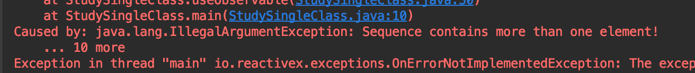

# RxJava
## Single Class

> [ReactiveX 공식 홈페이지 싱글 클래스 Doucment 싱글 클래스 마블 다이어그램](http://reactivex.io/documentation/ko/single.html)

- Single 클래스는 오직 1개의 데이타만 발행하도록 한정
- 데이터 하나 발행과 동시에 종료(onSuccess)됨으로 onNext(), onComplete()가 onSucess()로 통함
  
### just() 함수
- Single 클래스를 생성하는 정적 팩토리 함수
```java
Single<String> source = Single.just("just");
source.subscribe(System.out::println);
```
### Observable에서 Single 클래스 사용
```java{3,10,21,27,33}
// 1. Observable -> Single
// 기존 Observable에서 첫 번째 값을 발행하면 onSuccess 이벤트를 호출한 후 종료
Observable<String> stringObservable = Observable.just("Observable -> Single");
Single.fromObservable(stringObservable)
        .subscribe(System.out::println);

// 2. just() 함수를 통해 생성된 Observable에 single() 함수를 통한 Single 사용
// default value를 인자로 가짐
Observable.just("single()")
        .single("default Item")
        .subscribe(System.out::println);
//        Observable.just(1, 2, 3, 4, 5)
//                .single(3)
//                .subscribe(System.out::println);

// 3. first()
// 여러개의 데이터를 발행하는 Observable 객체를 Single 객체로
// 첫 번째 데이터를 발행 후 onSuccess 이벤트 발생
// 3장에서 자세히
Observable.fromArray("red", "blue", "gold")
        .first("first")
        .subscribe(System.out::println);

// 4. empty()
// single() 함수를 통해 기본값을 가지는 Single 객체를 생성 함
Observable.empty()
        .single("default value")
        .subscribe(System.out::println);

// 5. take()
// 3장에서 자세히
Observable.just(new Order("oder 1"), new Order("oder 2"))
        .take(1)
        .single(new Order("default order"))
        .subscribe(System.out::println);
```

### Single 클래스 올바른 사용 방법
- 싱글 클래스에 여러 데이터를 발행하도록 하면 에러가 발생한다.


> 함수? 메서드?  
> 리액티브 프로그래밍은 함수형 프로그래밍 기법을 활용하므로 용어를 혼용해서 사용할 수 있습니다.  
> 이 책에서는 함수형 프로그래밍에 가까운 리액티브 연산자는 함수라고 표기  
> 일반 자바 언어 기반은 메서드로 표기합니다.